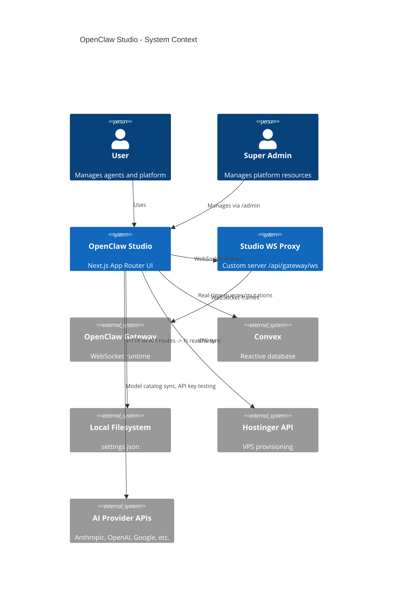
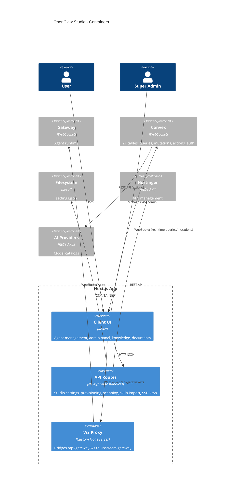

# Architecture

## High-level overview & goals
OpenClaw Studio is a multi-tenant Next.js App Router platform for managing OpenClaw agents, infrastructure, and AI resources. It provides:
- A focused UI with fleet list, primary agent panel, and inspect sidebar for real-time agent management.
- A **Convex** reactive database as the primary persistence layer for organizations, users, providers, models, skills, knowledge, documents, deployments, VPS/gateway instances, and system settings.
- Local persistence for gateway connection + focused-view preferences via a JSON settings file.
- A same-origin WebSocket bridge (`/api/gateway/ws`) from browser to the upstream OpenClaw gateway.
- Gateway-backed edits for agent config and agent files.
- A super-admin panel (`/admin`) for platform-wide management of users, organizations, providers, models, skills, VPS instances, and system settings.
- An org-member dashboard for knowledge management, document storage, and instance deployment.

Primary goals:
- **Gateway-first**: agents, sessions, and config live in the gateway; Studio stores only UI settings.
- **Convex for persistence**: structured data (orgs, users, providers, models, skills, knowledge, documents, deployments, VPS/gateway instances, settings) lives in Convex.
- **Multi-tenant**: organizations with plans, roles, and resource quotas.
- **Remote-friendly**: tailnet/remote gateways are first-class.
- **Clear boundaries**: client UI vs server routes vs external gateway/config vs Convex backend.
- **Predictable state**: gateway is source of truth for agent runtime; Convex is source of truth for platform data; local settings only for focused preferences + connection.
- **Maintainability**: feature-focused modules, minimal abstractions.

Non-goals:
- Server-side rendering of data from external services.

## Architectural style
**Layered + vertical slice (feature-first)** within Next.js App Router:
- UI components + feature state in `src/features`.
- Shared utilities and adapters in `src/lib`.
- Server-side route handlers under `src/app/api`.
- Convex backend functions under `convex/`.
- Admin panel under `src/app/admin`.

This keeps feature cohesion high while preserving a clear client/server boundary.

## Main modules / bounded contexts

### Core platform (Convex)
- **Users & auth** (`convex/auth.ts`, `convex/users.ts`, `convex/sessionContext.ts`): Convex Auth with password provider. User profiles with roles (`superAdmin`/`orgAdmin`/`member`). Session context aggregates user + profile + orgs + gateways.
- **Organizations** (`convex/organizations.ts`, `convex/orgMembers.ts`): multi-tenant orgs with plans (`free`/`starter`/`pro`/`enterprise`), statuses, settings (maxAgents, maxVps, maxInstances, enabledSkillCategories, features). Org members with roles (`owner`/`admin`/`member`/`viewer`).
- **Providers** (`convex/providers.ts`, `convex/providerCredentials.ts`): AI provider definitions (`llm`/`tts`/`stt`/`image`). Per-provider API credentials with sensitive value masking. API key testing (Anthropic, OpenAI, Google, ElevenLabs, Kimi, Zai, Minimax).
- **Models** (`convex/models.ts`, `convex/lib/modelCatalog.ts`): AI model catalog with capabilities (reasoning, vision, toolCalling, streaming), context windows, costs. Dynamic sync from provider APIs via `syncCatalog` action. Metadata enrichment in `modelCatalog.ts`.
- **Skills** (`convex/skills.ts`): global skill catalog with categories (`mcp`/`prompt`/`workflow`), runtimes (`node`/`python`/`none`), dependencies, envKeys (declared required environment variables). Plan-based availability. Import from GitHub repos via SKILL.md parsing. Internal backfill mutation for metadata extraction from skill content (envKeys from `metadata.openclaw.requires.env` + body `export` patterns, dependencies from `install[].package/formula/module` + body `npm/pip install` patterns, runtime from metadata bins + body content patterns).
- **Skill env values** (`convex/skillEnvValues.ts`): org-scoped secret values for skill-declared env keys. Masked list, reveal, upsert, remove. Used by instance assignment validation.
- **Instance skills** (`convex/instanceSkills.ts`): skill-to-gateway-instance assignments. Validates org plan access and required env key configuration before assignment.
- **Knowledge** (`convex/knowledge.ts`, `convex/knowledgeProposals.ts`): org-scoped knowledge base with full-text search. Agent-proposed entries with pending/approved/rejected workflow.
- **Documents** (`convex/documents.ts`): org-scoped documents with types (`general`/`spec`/`runbook`/`reference`), tags, full-text search, optional file attachments via Convex storage.
- **VPS instances** (`convex/vpsInstances.ts`): physical VPS server records. Hostinger API integration for VM discovery/sync.
- **Gateway instances** (`convex/gatewayInstances.ts`): OpenClaw instances on VPS (junction: VPS + org). Tracks port, token, URL, status, agent count, deployment reference.
- **Org VPS access** (`convex/orgVpsAccess.ts`): org-to-VPS access assignments with instance quotas.
- **Deployments** (`convex/deployments.ts`): provisioning lifecycle with real-time step tracking (queued/provisioning/running/failed/cancelled). Config includes model selection, skill assignments, brain files, role template, agent identity, gateway auth.
- **System settings** (`convex/systemSettings.ts`): key-value settings by category (`general`/`ai`/`agent`/`identity`/`vps`/`security`) with sensitive masking.
- **Authorization** (`convex/lib/authorization.ts`): `requireAuth`, `requireSuperAdmin`, `requireOrgAccess` helpers. Org access checks member role and supports superAdmin override.

### Admin panel (`src/app/admin`)
- **Dashboard** (`/admin`): overview stats.
- **Users** (`/admin/users`): list, create, update roles.
- **Organizations** (`/admin/organizations`): CRUD, plan/status management.
- **Providers** (`/admin/providers`): CRUD, API key management with test button and status badges.
- **Models** (`/admin/models`): CRUD, sync from provider APIs.
- **Skills** (`/admin/skills`): CRUD, GitHub import, enable/disable, plan availability, env keys editor, search, runtime/category badges.
- **VPS** (`/admin/vps`): CRUD, Hostinger sync, SSH details, tag management.
- **Settings** (`/admin/settings`): category-based key-value pairs.
- **Shared components** (`src/features/admin/components`): `AdminHeader`, `AdminSidebar`, `ConfirmDialog`, `SensitiveField`, `StatsCard`.

### Focused agent UI (`src/features/agents`)
- Fleet sidebar with agent list, status, create action.
- Primary agent panel with chat interface, model/thinking controls.
- Inspect panels for brain files, cron jobs, settings.
- Gateway connect screen with retry controls.
- Deploy instance modal.
- State management via Zustand store (`store.tsx`).
- Operations: fleet hydration, chat send, cron create, agent delete, config mutation queue.
- Runtime event bridge classifies gateway events (`presence`/`heartbeat`/`chat`/`agent`).
- Session settings mutations with optimistic state.

### Knowledge & documents
- **Knowledge panel** (`src/features/knowledge`): browse, search, create entries, manage proposals.
- **Documents panel** (`src/features/documents`): browse, search, create with file attachments.

### Studio settings (`src/lib/studio`, `src/app/api/studio`)
- Local settings store for gateway URL/token and focused preferences (`settings.json` under `~/.openclaw/openclaw-studio/`).
- `coordinator.ts` owns both transport helpers and client-side load/patch scheduling.

### Gateway (`src/lib/gateway`)
- WebSocket client for agent runtime (frames, connect, request/response).
- Session settings sync via `sessions.patch`.
- Vendored OpenClaw control UI client (`GatewayBrowserClient.ts`).
- Model capabilities + context window metadata.

### Studio gateway proxy server (`server/`)
- `index.js`: custom Node server wrapping Next.js with WS proxy and access gate.
- `gateway-proxy.js`: bridges `/api/gateway/ws` to upstream gateway with server-side token injection.
- `access-gate.js`: optional `STUDIO_ACCESS_TOKEN` authentication.
- `studio-settings.js`: server-side settings loader.

### API routes (`src/app/api`)
- `POST /api/studio` — load/save studio settings.
- `GET /api/path-suggestions` — autocomplete file paths.
- `POST /api/org/provision-gateway` — deploy OpenClaw instance on VPS via SSH.
- `PUT /api/org/manage-gateway` — update running gateway instance config.
- `POST /api/org/knowledge` — create knowledge entries.
- `POST /api/org/knowledge/propose` — agent proposes knowledge (Bearer token auth).
- `POST /api/gateway/agent-state` — trash/restore agent state locally or over SSH.
- `GET /api/admin/scan-vps` — SSH discovery of OpenClaw instances on VPS.
- `POST /api/admin/skills/import` — import skills from GitHub repo (discovers SKILL.md files, parses YAML frontmatter + metadata JSON, extracts envKeys/dependencies/runtime).
- `POST /api/admin/ssh-keys/setup` — generate SSH key for studio.
- `POST /api/admin/ssh-keys/deploy` — deploy SSH key to VPS.
- `GET /api/admin/ssh-keys/diagnose` — diagnose SSH connectivity.
- `/api/task-control-plane` — Beads CLI integration (list, show, priority).

### Provisioning (`src/lib/provisioning`)
- `config-generator.ts`: generate `openclaw.json` + auth profiles for new instances.
- `port-allocator.ts`: allocate free ports on VPS.
- `validation.ts`: instance name + path validation.

### Task control plane (`src/app/control-plane`, `src/lib/task-control-plane`)
- Read-only Kanban board driven by Beads (`br`) JSON output.
- Local or SSH execution of Beads CLI.

## Directory layout (top-level)
- `src/app`: Next.js App Router pages, layouts, global styles, and API routes.
- `src/app/admin`: Super-admin panel pages and layout.
- `src/features`: feature-first UI modules (agents, admin, knowledge, documents, task-control-plane).
- `src/lib`: domain utilities, adapters, API clients, and shared logic.
- `src/providers`: React context providers (`ConvexClientProvider`).
- `src/components`: shared UI components.
- `src/styles`: shared styling assets.
- `convex/`: Convex backend — schema, functions, auth, migrations, and auto-generated types (`_generated/`).
- `convex/lib/`: shared backend helpers (authorization, model catalog).
- `server`: custom Node server and WS proxy for gateway bridging + access gate.
- `public`: static assets.
- `tests`, `playwright.config.ts`, `vitest.config.ts`: automated testing.

## Data flow & key boundaries

### 1) Convex (reactive database — primary persistence)
- **Client boundary**: `ConvexClientProvider` in `src/providers/ConvexClientProvider.tsx` creates a singleton `ConvexReactClient` and wraps the app tree via `ConvexProvider`. React components use `useQuery`/`useMutation` hooks from `convex/react` to read/write data. Auth state from `@convex-dev/auth`.
- **Server boundary**: Convex functions (queries, mutations, actions) live in `convex/` and run on the Convex cloud. Schema defined in `convex/schema.ts` with 17 application tables + 4 auth tables.
- **Dev workflow**: run `npm run dev:convex` alongside `npm run dev` to watch and push Convex function changes.

Tables: `userProfiles`, `organizations`, `orgMembers`, `vpsInstances`, `gatewayInstances`, `providers`, `providerCredentials`, `models`, `skills`, `instanceSkills`, `skillEnvValues`, `knowledge`, `knowledgeProposals`, `documents`, `orgVpsAccess`, `deployments`, `systemSettings` (+ auth tables: `users`, `accounts`, `sessions`, `verificationCodes`).

Flow:
1. `ConvexReactClient` connects to the Convex deployment via `NEXT_PUBLIC_CONVEX_URL`.
2. React components subscribe to queries — Convex pushes real-time updates over WebSocket.
3. Mutations execute transactionally on the Convex server.
4. Actions (e.g. `syncCatalog`, `testApiKey`, `syncVpsFromHostinger`) can call external APIs.
5. Schema changes and function deploys happen via `npx convex dev` (dev) or `npx convex deploy` (prod).

### 2) Studio settings + focused preferences
- **Source of truth**: JSON settings file at `~/.openclaw/openclaw-studio/settings.json`.
- **Server boundary**: `src/app/api/studio/route.ts` loads/saves settings.
- **Client boundary**: `StudioSettingsCoordinator` in `src/lib/studio/coordinator.ts` manages load/debounced-patch scheduling.

### 3) Agent runtime (gateway)
- **Client-side boundary**: `GatewayClient` connects to Studio-origin `/api/gateway/ws`.
- **Server-side boundary**: custom server proxy (`server/gateway-proxy.js`) handles upstream URL/token resolution and connect-frame token injection.

Flow:
1. UI loads gateway URL/token from `/api/studio`.
2. Browser opens WS to Studio `/api/gateway/ws`.
3. Proxy forwards to upstream gateway with server-side auth injection.
4. A single gateway listener classifies events through `runtimeEventBridge.ts`.
5. Agent store updates agent output/state.

### 4) Agent config + agent files
- **Agent files**: `AGENTS.md`, `SOUL.md`, `IDENTITY.md`, `USER.md`, `TOOLS.md`, `HEARTBEAT.md`, `MEMORY.md`.
- **Create + heartbeat + rename**: stored in gateway config via `config.get` + `config.patch`.
- **File edits**: via gateway WebSocket `agents.files.get` / `agents.files.set`.

### 5) Skills + instance assignment
- **Skill catalog**: global skills stored in Convex, imported from GitHub repos via `/api/admin/skills/import`.
- **Import pipeline**: discovers SKILL.md files in repo tree, parses YAML frontmatter, extracts metadata JSON (`openclaw.requires.env`, `openclaw.install`, `openclaw.requires.bins`), scans body for `export KEY=`/`npm install`/`pip install` patterns.
- **Instance assignment**: validates org plan access + required env key configuration before allowing skill assignment to a gateway instance.
- **Org env values**: per-org secret values for skill-declared env keys (masked in UI, revealed on demand).

### 6) Provider credentials + model catalog
- **Providers**: system-wide AI provider definitions with type, base URL, OAuth support.
- **Credentials**: per-provider API keys, sensitive values masked in list queries, revealed on demand.
- **Model catalog**: synced from provider APIs (Anthropic, OpenAI, Google, etc.) via `syncCatalog` action. Enriched with capabilities metadata from `modelCatalog.ts`.
- **API key testing**: lightweight test calls per provider type.

### 7) VPS + gateway instance management
- **VPS instances**: physical servers tracked with IP, SSH access, capacity, tags.
- **Hostinger integration**: `syncVpsFromHostinger` action fetches VMs from Hostinger API.
- **Gateway discovery**: `/api/admin/scan-vps` SSHes into VPS, discovers OpenClaw instances (processes, Docker containers, docker-compose).
- **Gateway instances**: OpenClaw runtime instances on VPS, tracked with port, token, status, agent count.
- **Org VPS access**: assign VPS to orgs with instance quotas.

### 8) Deployment lifecycle
- **Create deployment**: allocates port, generates config, tracks provisioning steps.
- **Step tracking**: real-time updates via Convex mutations (pending → running → success/failed).
- **SSH provisioning**: `POST /api/org/provision-gateway` deploys via SSH to target VPS.

### 9) Knowledge + documents
- **Knowledge base**: org-scoped entries with full-text search via Convex search indexes.
- **Proposals**: agents propose knowledge entries (Bearer token auth), org admins approve/reject.
- **Documents**: org-scoped with types, tags, full-text search, optional file attachments via Convex storage.

### 10) Task control plane (Beads)
- **UI boundary**: `/control-plane` page fetches from `/api/task-control-plane`.
- **Server boundary**: runs Beads CLI (`br`) locally or via SSH, parses JSON output.
- **Read model**: converts raw Beads lists into Kanban board snapshot.

## Cross-cutting concerns
- **Authentication**: Convex Auth with password provider. Super admin role for system management. Org-based access with role checks. Bearer token auth for agent API endpoints. Optional `STUDIO_ACCESS_TOKEN` for server access gate.
- **Authorization**: `requireAuth`, `requireSuperAdmin`, `requireOrgAccess` helpers in `convex/lib/authorization.ts`. Org access validates member role with superAdmin override.
- **Multi-tenant isolation**: org-scoped data via `orgId` indexes across Convex tables. Plan-based feature gating. Resource quotas (maxAgents, maxVps, maxInstances).
- **Configuration**: env vars (`NEXT_PUBLIC_GATEWAY_URL`, `NEXT_PUBLIC_CONVEX_URL`, `STUDIO_UPSTREAM_GATEWAY_URL`, `STUDIO_UPSTREAM_GATEWAY_TOKEN`, `STUDIO_ACCESS_TOKEN`). `lib/clawdbot/paths.ts` resolves config/state dirs. Convex deployment in `.env.local`.
- **Sensitive data**: provider credentials and skill env values masked in list queries, revealed via dedicated mutations. System settings support sensitive flag.
- **Logging**: API routes and gateway client use `console.*` logging.
- **Error handling**: API routes return JSON `{ error }` with status codes. Gateway errors use `GatewayErrorInfo` type. Structured error classification for connect failures.
- **Full-text search**: Convex search indexes on `knowledge.content` and `documents.content`, filtered by `orgId`.
- **Cascading operations**: deleting a provider cascades to credentials + models. Deleting a skill cascades to instanceSkills + skillEnvValues.
- **Tracing**: `src/instrumentation.ts` registers `@vercel/otel` for telemetry.

## Major design decisions & trade-offs
- **Convex as primary persistence, local settings file for UI preferences**: Convex provides reactive, real-time persistence for structured platform data. Local settings file remains for gateway connection + focused preferences (fast, local-first). Two persistence layers serve distinct purposes.
- **Multi-tenant with Convex**: organizations, roles, and quotas enable platform use without requiring per-tenant database instances. Trade-off is org-scoped index filtering on queries.
- **Skill metadata extraction from content**: skills declare env requirements and dependencies in SKILL.md frontmatter metadata JSON and body patterns. Extraction logic handles multiple formats (structured YAML, comma-separated, metadata JSON, body scanning). Trade-off is heuristic-based parsing.
- **Same-origin WS proxy instead of direct browser->gateway WS**: allows server-side token custody/injection and easier local/remote switching.
- **Gateway-first agent records**: records map 1:1 to `agents.list` entries with main sessions.
- **Gateway-backed config + agent-file edits**: create/rename/heartbeat/delete via `config.patch`, files via gateway WebSocket.
- **Dynamic model catalog sync**: models are fetched from provider APIs rather than hardcoded. Trade-off is API dependency for catalog updates, but ensures accuracy.
- **SSH-based VPS operations**: discovery, provisioning, and agent state management via SSH. Trade-off is SSH key management complexity, but enables remote infrastructure control.
- **Deployment step tracking**: real-time step updates via Convex mutations during provisioning. Trade-off is more granular mutation calls, but provides visibility.
- **Knowledge proposal workflow**: agents propose, humans approve. Trade-off is friction for knowledge creation, but ensures quality control.
- **Feature-first organization**: increases cohesion in UI; trade-off is more discipline to keep shared logic in `lib`.

## Mermaid diagrams
### C4 Level 1 (System Context)

### C4 Level 2 (Containers/Components)

## Explicit forbidden patterns
- Do not read/write local files directly from client components.
- Do not reintroduce local projects/workspaces as a source of truth for agent records.
- Do not write agent rename/heartbeat data directly to `openclaw.json`; use gateway `config.patch`.
- Do not read/write agent files on the local filesystem; use the gateway tools proxy.
- Do not add parallel gateway settings endpoints; `/api/studio` is the only supported Studio gateway URL/token path.
- Do not store gateway tokens or secrets in client-side persistent storage.
- Do not add new global mutable state outside `AgentStoreProvider` for agent UI data.
- Do not silently swallow errors in API routes; always return actionable errors.
- Do not add heavy abstractions or frameworks unless there is clear evidence of need.
- Do not bypass Convex auth helpers (`requireAuth`, `requireSuperAdmin`, `requireOrgAccess`) in server functions.
- Do not store sensitive values unmasked in Convex query responses; use dedicated reveal mutations.
- Do not allow skill assignment without validating required env key configuration.

## Future-proofing notes
- Convex is currently on the free tier. When self-hosting becomes a goal, the schema and functions remain the same — only the deployment target changes.
- If gateway protocol evolves, isolate changes within `src/lib/gateway` and keep UI call sites stable.
- Provider credentials system is designed for per-org scoping but currently primarily uses system-level keys.
- Deployment provisioning is SSH-based; container orchestration (Kubernetes) could be added as an alternative provisioner.
